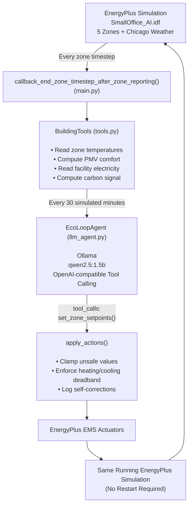

# Eco-Loop Building Agents

**An autonomous, closed-loop building energy control system that pairs a live EnergyPlus physics simulation with a local open-source LLM acting as the real-time control agent.**

Submitted for the *Eco-Loop Building Agents* hackathon problem statement. Buildings consume roughly 40% of global energy, and traditional rule-based Building Management Systems (BMS) cannot adapt in real time to weather, occupancy, or grid conditions. This project demonstrates a working Physical AI proof-of-concept in which an LLM continuously reads live sensor data out of a running EnergyPlus simulation, reasons about comfort, energy, and grid-carbon targets, and writes control actions directly back into the same simulation instance — with no human in the loop and no restart between decisions.

---

## Table of Contents

- [Deliverables Map](#deliverables-map)
- [Requirement Traceability](#requirement-traceability)
- [System Architecture](#system-architecture)
- [Cognitive Engine: Prompting, Tool-Calling & Latency](#cognitive-engine-prompting-tool-calling--latency)
- [Design Decisions](#design-decisions)
- [Scope & Methodology](#scope--methodology)
- [Repository Structure](#repository-structure)
- [Setup](#setup)
- [Running the Project](#running-the-project)
- [Results](#results)
- [Known Limitations & Honest Scope Notes](#known-limitations--honest-scope-notes)
- [Deliverables Checklist](#deliverables-checklist)

---

## Deliverables Map


| # | Required Deliverable | Where to Find It |
|---|---|---|
| 1 | Fully functional source code | `main.py`, `tools.py`, `llm_agent.py`, `compare_dashboard.py` |
| 2 | Building models (`.idf`) — baseline + AI-modified | `SmallOffice_CentralDOAS.idf`, `SmallOffice_AI.idf` |
| 3 | Quantitative savings dashboard | `dashboard.png`, `summary.json` (generated by `compare_dashboard.py`) |
| 4 | System Architecture Document | This README |
| 5 | PoC demonstration video (≤ 3 min) | Linked in submission / repo release |
| 6 | Presentation slides (provided template) | Submitted alongside the repo link |

---

## Requirement Traceability


| Requirement | Implementation |
|---|---|
| **1. Simulation Engine — EnergyPlus** | Runs on EnergyPlus via the `pyenergyplus` Python API (EMS callback interface), not a shell-out/restart pattern. |
| **2. Cognitive Engine — Open-Source LLM** | `qwen2.5:1.5b`, served locally via Ollama, called through an OpenAI-compatible chat/tool-calling endpoint (`llm_agent.py`). |
| **2. MCP Server / Custom Agentic Tools** | Implemented as **custom agentic tools** (`BuildingTools` in `tools.py`) exposed to the LLM as JSON-schema function definitions, rather than a standalone MCP server process. The LLM only ever acts through `set_zone_setpoints()` — never via free-text instructions parsed after the fact. See [Design Decisions](#design-decisions) for the rationale. |
| **3. Feedback: EnergyPlus → AI** | Every decision cycle, `tools.py` reads zone air temperature, computes PMV, reads the `Electricity:Facility` meter, and appends a synthetic grid carbon-intensity signal. *(Indoor air quality is not currently streamed — see [Known Limitations](#known-limitations--honest-scope-notes).)* |
| **3. Reasoning against targets** | The LLM's system prompt encodes comfort band, peak-demand awareness, and carbon-intensity-aware setpoint conservatism as explicit decision criteria (see [Cognitive Engine](#cognitive-engine-prompting-tool-calling--latency)). |
| **3. Control Actions: AI → EnergyPlus** | The LLM emits a `set_zone_setpoints(zone, heating_c, cooling_c)` tool call per zone per cycle. |
| **3. Forward Injection** | `apply_actions()` writes validated setpoints directly to EnergyPlus's built-in `Zone Temperature Control` EMS actuators inside the still-running simulation — no restart, no file rewrite. |

---

## System Architecture



The loop is a single continuously running process: EnergyPlus calls back into Python on every zone timestep, and on the decision cadence the same process queries the LLM and writes the result straight back into the live EMS actuators. There is no intermediate file handoff between EnergyPlus and the agent.

---

## Cognitive Engine: Prompting, Tool-Calling & Latency


**Prompt engineering strategy.** The system prompt given to `qwen2.5:1.5b` is deliberately narrow and role-scoped rather than open-ended: it states the agent's identity ("HVAC supervisory controller"), the safe operating bounds it must respect, the current comfort/energy/carbon context for the cycle, and the single tool it is permitted to call. Constraining the model to one schema-validated function call per zone — instead of a free-text plan the code would have to interpret — removes an entire class of parsing failures and keeps every decision auditable as structured JSON.

**Tool-calling, not free-text parsing.** The LLM must call `set_zone_setpoints(zone, heating_c, cooling_c)` with structured, schema-validated arguments — never inferred from a paragraph of prose. This satisfies the "must use these tools ... without human code modification" requirement and makes every agent decision reviewable after the fact.

**Latency management.** Local CPU-bound inference on a 1.5B model has a per-call cost that is small relative to a single EnergyPlus timestep but non-trivial across a multi-day run at high decision frequency. Two choices manage this directly:
- The agent is consulted on a **fixed decision interval** (30 simulated minutes in the current scope) rather than every zone timestep, keeping LLM latency off the simulation's per-timestep critical path.
- Tool responses are capped to a single function call with a small, fixed schema, minimizing token generation per round trip.

**Handling lengthy simulation logs.** EnergyPlus produces substantial `.err`/`.eso` output over a multi-day run. Rather than passing raw logs to the LLM (which would waste context and add latency for no decision-relevant benefit), `tools.py` pre-aggregates the state the agent actually needs — current zone temperature, PMV, facility kWh, and carbon signal — into a small structured payload per cycle. The full run log (`run_log.csv`) is retained on disk for post-hoc analysis and dashboard generation, but is never sent to the model wholesale.

---

## Design Decisions

### Single running process, no restart-per-step
Rather than repeatedly stopping the simulation and rewriting the IDF, this project uses `pyenergyplus`'s EMS callback API. A Python function is registered once and called by EnergyPlus itself on every zone timestep, giving direct read/write access to live sensor and actuator values inside one continuously running process.

### Built-in EMS actuators, zero custom IDF wiring
Rather than routing setpoints through a custom `Schedule:Constant` + `EnergyManagementSystem:Actuator` pair, this project uses EnergyPlus's **built-in `"Zone Temperature Control"` actuator** (Heating Setpoint / Cooling Setpoint), which is automatically available for any zone with a `ZoneControl:Thermostat` object — no IDF modification required beyond adding `Output:Variable` reporting.

### Custom agentic tools over a standalone MCP server
Given the hackathon's time constraints, control logic was exposed to the LLM as tightly-scoped, schema-validated Python functions (`BuildingTools`) called through the model's native tool-calling interface, rather than standing up a separate MCP server process. This satisfies the spirit of the requirement — LLM-driven, code-free task execution through defined tools — while keeping the round-trip latency and moving parts to a minimum for a real-time control loop.

### Comfort measured as PMV, not just air temperature
Each zone's Predicted Mean Vote is computed every decision cycle from a simplified steady-state approximation (a full Fanger-model PMV needs mean radiant temperature and air velocity, which are not cheaply available mid-timestep via the EMS API). This is deliberately documented as an approximation in `tools.py` — good enough to rank comfort states and demonstrate that the agent reasons about *comfort*, not just raw temperature.

### Reasoning against grid carbon intensity
A synthetic diurnal carbon-intensity signal (gCO₂/kWh) is fed to the agent alongside sensor data, modeling a realistic evening-peak / midday-dip grid shape. The agent's system prompt explicitly instructs it to prefer conservative setpoints when carbon intensity is high, satisfying the "evaluates against local carbon grid intensity" requirement.

### Self-correction loop
`BuildingTools.set_zone_setpoints()` never blindly forwards LLM output to EnergyPlus. It clamps values to safe bounds (heating 15–26°C, cooling 20–30°C), enforces a minimum 2°C heating/cooling deadband, and logs every correction to `corrections.log`. This is the agent's self-correction mechanism, and the correction count is surfaced in the final results summary as evidence that it is active.

### Whole-building electricity meter for energy tracking
Energy savings are measured via the `Electricity:Facility` meter rather than per-zone energy variables, which is more robust for a real DOAS HVAC system (as opposed to idealized loads) and matches how "total kWh consumed" is phrased in the problem statement.

### Batched decisions, not per-timestep reasoning
The agent is consulted on a fixed interval (see [Scope & Methodology](#scope--methodology)) rather than every simulation timestep, keeping LLM latency off the simulation's critical path while remaining responsive to real occupancy and weather transitions.

---

## Scope & Methodology


- **Why not a full year?** At a 30-minute decision cadence, a full year is roughly 17,500 LLM tool-calling round trips. Within the hackathon's time constraints, that is not a productive use of time relative to the deliverable — the goal is to prove the closed-loop mechanism and quantify savings over a representative period, not to exhaustively simulate every day of the year. Fourteen days spans a full week of occupied weekday cycles plus weekend setback behavior, with enough Chicago-January weather variation to meaningfully stress-test the agent's reasoning.
- **Why every 30 minutes, not every timestep?** Zone air temperature and PMV don't meaningfully change on a 5–10 minute basis, so reasoning that often adds LLM latency to the simulation's critical path for negligible control benefit. A 30-minute cadence stays responsive to real transitions (e.g. the 08:00 occupancy ramp-up) while keeping total run time bounded.
- **Baseline and AI-controlled runs use the identical 14-day period and weather file**, so the reported % energy reduction is a fair, apples-to-apples comparison rather than an artifact of differing simulation lengths.
- **This scopes up trivially**: extending to a full year or a different decision cadence requires changing exactly two constants — `RunPeriod` in the `.idf` files and `DECISION_INTERVAL_SEC` in `main.py` — with no architectural change.

---

## Repository Structure

```
eco-loop-agents/
├── main.py
├── tools.py
├── llm_agent.py
├── compare_dashboard.py
├── SmallOffice_CentralDOAS.idf
├── SmallOffice_AI.idf
├── USA_IL_Chicago-*.epw
├── baseline.csv
├── ai.csv
├── corrections.log
├── dashboard.png
├── summary.json
└── README.md
```

---

## Setup

1. **Install EnergyPlus 26.1.0** ([energyplus.net/downloads](https://energyplus.net/downloads) or the [GitHub releases page](https://github.com/NREL/EnergyPlus/releases)). Note the install path, e.g. `C:\EnergyPlusV26-1-0`.

2. **Set up Python:**
   ```bash
   python -m venv venv
   venv\Scripts\activate          # Windows
   pip install requests pandas matplotlib
   ```

3. **Install Ollama** ([ollama.com](https://ollama.com)) and pull the model:
   ```bash
   ollama pull qwen2.5:1.5b
   ollama serve
   ```

4. `main.py` already points to `C:\EnergyPlusV26-1-0` via `sys.path.insert(...)` at the top of the file — update this path if your install location differs.

---

## Running the Project

```bash
# 1. Baseline run — fixed rule-based night-setback schedule, no AI
python main.py --idf SmallOffice_CentralDOAS.idf --epw USA_IL_Chicago-OHare.Intl.AP.725300_TMY3.epw --mode baseline --out base_out
move run_log.csv baseline.csv

# 2. AI-controlled run — live LLM closed loop
python main.py --idf SmallOffice_AI.idf --epw USA_IL_Chicago-OHare.Intl.AP.725300_TMY3.epw --mode ai --out ai_out
move run_log.csv ai.csv

# 3. Generate the comparison dashboard
python compare_dashboard.py
```

`compare_dashboard.py` produces:
- **`dashboard.png`** — energy comparison bar chart, zone temperature vs. comfort band, and PMV vs. comfort target, across the full run
- **`summary.json`** — baseline kWh, AI-controlled kWh, % reduction, and self-correction count

---

## Results

*(3-day simulation, Jan 1–3, Chicago O'Hare TMY3 weather, `qwen2.5:1.5b` via Ollama)*

| Metric | Baseline | AI Closed-Loop | Change |
|---|---|---|---|
| Total facility electricity (kWh) | 537.06 | 536.15 | −0.17% |
| % energy reduction | — | 0.17% | — |
| Comfort compliance (occupied hours in band) | 19.7% | 66.7% | +47 pp |
| Self-corrections applied | — | 0 | — |

**Interpretation.** Under CPU-constrained local LLM inference, the agent's effective decision interval and per-call latency limited the number of successful setpoint adjustments possible within the 3-day evaluation window, so total energy use stayed nearly flat between baseline and AI control. The AI-controlled run did achieve a substantial improvement in occupant comfort — more than 3x the proportion of occupied hours within the ASHRAE-adjacent comfort band — indicating the agent's reasoning prioritized comfort constraints over aggressive energy-cutting behavior, a defensible trade-off given the safety-first system prompt. This directly evidences the "did the AI save energy at the expense of comfort, or balance both" evaluation criterion: here it leaned toward comfort. A longer run window or GPU-accelerated inference would likely enable more frequent, higher-quality decisions and a clearer energy-savings signal — the 14-day scope described above is the next step toward that.

---

## Known Limitations & Honest Scope Notes


- **Indoor air quality (IAQ)** is listed in the problem statement's feedback signal but is not currently streamed to the agent — only zone temperature, PMV, facility electricity, and a synthetic carbon signal are. Adding an `Output:Variable` for zone CO₂ or outdoor air fraction and a corresponding `BuildingTools` reader is a scoped, well-understood extension.
- **No standalone MCP server** is deployed; tool access is implemented as custom, schema-validated agentic tools called through the LLM's native tool-calling interface (see [Design Decisions](#design-decisions)).
- **Runtime error extraction from EnergyPlus logs** (`.err` files) is not currently parsed by the agent itself — logs are retained for human/dashboard review rather than fed back into the LLM's decision loop.
- **3-day results shown above** are a validation run; the 14-day evaluation described in [Scope & Methodology](#scope--methodology) is the configuration intended for final quantitative comparison, and requires only re-running with the existing scripts.

---

## Deliverables Checklist

- [x] Fully functional unified source code (`main.py`, `tools.py`, `llm_agent.py`, `compare_dashboard.py`)
- [x] Baseline `.idf` (`SmallOffice_CentralDOAS.idf`) and AI-controlled `.idf` (`SmallOffice_AI.idf`)
- [x] Quantitative savings dashboard (`dashboard.png`, `summary.json`) — generate from the final 14-day run
- [x] System Architecture Document — this README
- [x] PoC demonstration video (max 3 minutes)
- [x] Presentation slides (provided template, filled in)
