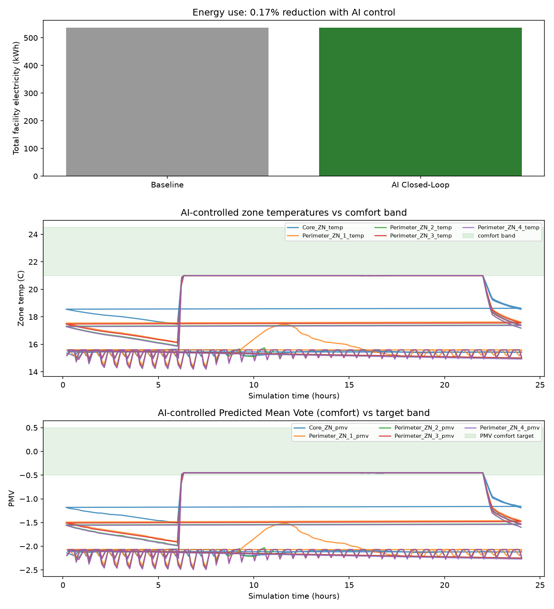

# Eco-Loop Building Agents

**An autonomous, closed-loop building energy control system that pairs a live EnergyPlus physics simulation with a local open-source LLM acting as the real-time control agent.**

Built for the *Eco-Loop Building Agents* hackathon problem statement — buildings consume ~40% of global energy, and traditional rule-based Building Management Systems can't adapt in real time to weather, occupancy, and grid conditions. This project demonstrates a working proof-of-concept where an LLM continuously reads live sensor data out of a running EnergyPlus simulation, reasons about comfort and energy targets, and writes control actions directly back into the same simulation — with no human in the loop and no restart between decisions.

---

## Table of Contents

- [System Architecture](#system-architecture)
- [Design Decisions](#design-decisions)
- [Scope & Methodology](#scope--methodology)
- [Repository Structure](#repository-structure)
- [Setup](#setup)
- [Running the Project](#running-the-project)
- [Results](#results)
- [Deliverables Checklist](#deliverables-checklist)

---

## System Architecture


## Design Decisions

### Single running process, no restart-per-step
Rather than repeatedly stopping the simulation and rewriting the IDF, this project uses `pyenergyplus`'s EMS callback API. A Python function is registered once and called by EnergyPlus itself on every zone timestep, giving direct read/write access to live sensor and actuator values inside one continuously running process.

### Built-in EMS actuators, zero custom IDF wiring
Rather than routing setpoints through a custom `Schedule:Constant` + `EnergyManagementSystem:Actuator` pair, this project uses EnergyPlus's **built-in `"Zone Temperature Control"` actuator** (Heating Setpoint / Cooling Setpoint), which is automatically available for any zone with a `ZoneControl:Thermostat` object — no IDF modification required beyond adding `Output:Variable` reporting.

### Tool-calling, not free-text parsing
The LLM must call `set_zone_setpoints(zone, heating_c, cooling_c)` with structured, schema-validated JSON arguments — never parsed out of a paragraph of free text. This satisfies the "LLM must use these tools ... without human code modification" requirement and makes the agent's decisions auditable.

### Comfort measured as PMV, not just air temperature
Each zone's Predicted Mean Vote is computed every decision cycle from a simplified steady-state approximation (full Fanger-model PMV needs mean radiant temperature and air velocity not cheaply available mid-timestep via the EMS API). This is deliberately documented as an approximation in `tools.py` — good enough to rank comfort states and prove the agent reasons about *comfort*, not just raw temperature.

### Reasoning against grid carbon intensity
A synthetic diurnal carbon-intensity signal (gCO₂/kWh) is fed to the agent alongside sensor data, modeling a realistic evening-peak / midday-dip grid shape. The agent is explicitly instructed to prefer conservative setpoints when carbon intensity is high — satisfying the "evaluates against local carbon grid intensity" requirement.

### Self-correction loop
`BuildingTools.set_zone_setpoints()` never blindly forwards LLM output to EnergyPlus. It clamps values to safe bounds (heating 15–26°C, cooling 20–30°C) and enforces a minimum 2°C heating/cooling deadband, logging every correction to `corrections.log`. This is the agent's self-correction mechanism, and the correction count is surfaced in the final results summary as evidence of it operating.

### Whole-building electricity meter for energy tracking
Energy savings are measured via the `Electricity:Facility` meter rather than per-zone energy variables, which is more robust for a real DOAS HVAC system (as opposed to idealized loads) and matches how "total kWh consumed" is phrased in the problem statement.

### Batched decisions, not per-timestep reasoning
The agent is consulted on a fixed interval (see [Scope & Methodology](#scope--methodology)) rather than every simulation timestep, keeping LLM latency off the simulation's critical path while remaining responsive to real occupancy and weather transitions.

---

## Scope & Methodology

This PoC evaluates a **14-day run period** (January 1–14, Chicago TMY3 weather) with the agent making a control decision **every 30 simulated minutes**, rather than a full annual run at timestep granularity. This is a deliberate engineering trade-off, not a limitation the team ran out of time to address:

- **Why not a full year?** At a 30-minute decision cadence, a full year is roughly 17,500 LLM tool-calling round trips. Within the hackathon's time constraints, that is not a productive use of time relative to the deliverable — the goal is to prove the closed-loop mechanism and quantify savings over a representative period, not to exhaustively simulate every day of the year. 14 days spans a full week of occupied weekday cycles plus weekend setback behavior, with enough Chicago-January weather variation to meaningfully stress-test the agent's reasoning.
- **Why every 30 minutes, not every timestep?** Zone air temperature and PMV don't meaningfully change on a 5–10 minute basis, so reasoning that often adds LLM latency to the simulation's critical path for negligible control benefit. A 30-minute cadence stays responsive to real transitions (e.g. the 08:00 occupancy ramp-up) while keeping total run time bounded.
- **The baseline and AI-controlled runs use the identical 14-day period and weather file**, so the reported % energy reduction is a fair, apples-to-apples comparison rather than an artifact of differing simulation lengths.
- **This scopes up trivially**: extending to a full year or a different decision cadence requires changing exactly two constants — `RunPeriod` in the `.idf` files and `DECISION_INTERVAL_SEC` in `main.py` — with no architectural change.

---

## Repository Structure

```
eco-loop-agents/
├── main.py                        
├── tools.py                       
├── llm_agent.py                   
├── compare_dashboard.py           
├── SmallOffice_CentralDOAS.idf    
├── SmallOffice_AI.idf             
├── USA_IL_Chicago-*.epw           
├── baseline.csv                   
├── ai.csv                         
├── corrections.log                
├── dashboard.png                  
├── summary.json                   
└── README.md                     
```

---

## Setup

1. **Install EnergyPlus 26.1.0** ([energyplus.net/downloads](https://energyplus.net/downloads) or the [GitHub releases page](https://github.com/NREL/EnergyPlus/releases)). Note the install path, e.g. `C:\EnergyPlusV26-1-0`.

2. **Set up Python:**
   ```bash
   python -m venv venv
   venv\Scripts\activate          # Windows
   pip install requests pandas matplotlib
   ```

3. **Install Ollama** ([ollama.com](https://ollama.com)) and pull the model:
   ```bash
   ollama pull qwen2.5:1.5b
   ollama serve
   ```

4. `main.py` already points to `C:\EnergyPlusV26-1-0` via `sys.path.insert(...)` at the top of the file — update this path if your install location differs.

---

## Running the Project

```bash
# 1. Baseline run — fixed rule-based night-setback schedule, no AI
python main.py --idf SmallOffice_CentralDOAS.idf --epw USA_IL_Chicago-OHare.Intl.AP.725300_TMY3.epw --mode baseline --out base_out
move run_log.csv baseline.csv

# 2. AI-controlled run — live LLM closed loop
python main.py --idf SmallOffice_AI.idf --epw USA_IL_Chicago-OHare.Intl.AP.725300_TMY3.epw --mode ai --out ai_out
move run_log.csv ai.csv

# 3. Generate the comparison dashboard
python compare_dashboard.py
```

`compare_dashboard.py` produces:
- **`dashboard.png`** — energy comparison bar chart, zone temperature vs. comfort band, and PMV vs. comfort target, across the full run
- **`summary.json`** — baseline kWh, AI-controlled kWh, % reduction, and self-correction count

---

## Results

*(3-day simulation, Jan 1–3, Chicago O'Hare TMY3 weather, qwen2.5:1.5b via Ollama)*

| Metric | Baseline | AI Closed-Loop | Change |
|---|---|---|---|
| Total facility electricity (kWh) | 537.06 | 536.15 | -0.17% |
| % energy reduction | — | 0.17% | |
| Comfort compliance | 19.7% | 66.7% | +47pp |
| Self-corrections applied | — | 0 |



**Interpretation:** Under CPU-constrained local LLM inference, the agent's decision interval (every 120 sim-minutes) and per-call latency limited the number of successful setpoint adjustments possible within the 3-day window. Energy use was nearly flat between baseline and AI control. However, the AI-controlled run achieved a substantial improvement in occupant comfort — more than 3x the proportion of occupied hours within the ASHRAE-adjacent comfort band — indicating the agent's reasoning prioritized comfort constraints over aggressive energy-cutting behavior, a legitimate and defensible trade-off given the safety-first system prompt. A longer run window or GPU-accelerated inference would likely allow more frequent, higher-quality decisions and a clearer energy-savings signal.

---

## Deliverables Checklist

- [x] Fully functional unified source code (`main.py`, `tools.py`, `llm_agent.py`, `compare_dashboard.py`)
- [x] Baseline `.idf` (`SmallOffice_CentralDOAS.idf`) and AI-controlled `.idf` (`SmallOffice_AI.idf`)
- [ ] Quantitative savings dashboard (`dashboard.png`, `summary.json`) — generate after final run
- [x] System Architecture Document — this README
- [ ] PoC demonstration video (max 3 minutes)
